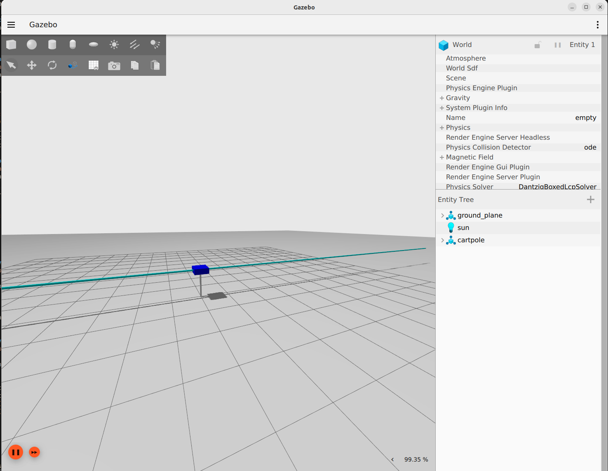

# Cartpole 
Author:       Ishaan Narain
Created:      15/02/2023 
Last Updated: 09/06/2023 

## Package Description
This package contains interfaces for a Cartpole dynamic system to test the ergodiclib reinforcement learning and controller package.

## ROS2 Launch Files
### Cartpole Gazebo Launch
`ros2 launch cartpole cartpole_gazebo.launch.xml`
Launches the Cartpole system model in an Ignition Gazebo simulation environment with an XTerm keryboard controller.

This launch file relies on the ROS2 `cartpole_key` node.

The parameters of the `cartpole_key` node are listed as follows:
* rate (float): Rate of Main Loop
* scale (float): Scale of force relative to teleop twist input
* max_force (float): Max Force allowed to publish to cartpole sim
* cart_path (string): Path to save the cart joint position outputs
* pole_path (string): Path to save the pole joint position outputs

### Cartpole Controller Launch
`ros2 launch cartpole cartpole_gazebo.launch.xml`
Launches the Cartpole system model in an Ignition Gazebo simulation environment with an option to run either a File controller or a Model Predictive Controller.

This launch file relies on the ROS2 `cartpole_ctrl` node.

The parameters of the `cartpole_ctrl` node are listed as follows:
* rate (float): Rate of Main Loop
* control_type (string) : Name of Controller Type ('file' or 'MPC')
* control_file (string) : File path to controls given 'file' option

## Scripts
### Cartpole Dynamics Plotter
`ros2 run cartpole cartpole_dynamics.py control_path trajectory_path`

This script generates plots of the trajectories and controls generated by a controller or human demonstration. 

The parameters of the `cartpole_dynamics.py` are listed as follows:
* control_path (string) : File path to the controller csv file
* trajectory_path (string) : File path to the Trajectory csv file

### Cartpole Dynamics Plotter
`ros2 run cartpole cartpole_file_util.py control_path trajectory_path`

This script generates a full state output csv based on the cart and pole trajectories generated by the `cartpole_key` ros2 node.

The parameters of the `cartpole_file_util.py` are listed as follows:
* cart_path (string): Path to cart txt file
* pole_path (string): Path to pole txt file
* output_path (string): Path to output csv file
* parse_lines (string): Bool to enable line parser and output

## References:
Alejandro Hernández Cordero, cartpole_gazebo, (2018), GitHub Repository, https://github.com/erlerobot/cartpole_gazebo

CART-pole system: Equations of Motion Nonlinear Dynamics - UC santa barbara. (2010). https://courses.ece.ucsb.edu/ECE594/594D_W10Byl/hw/cartpole_eom.pdf 

