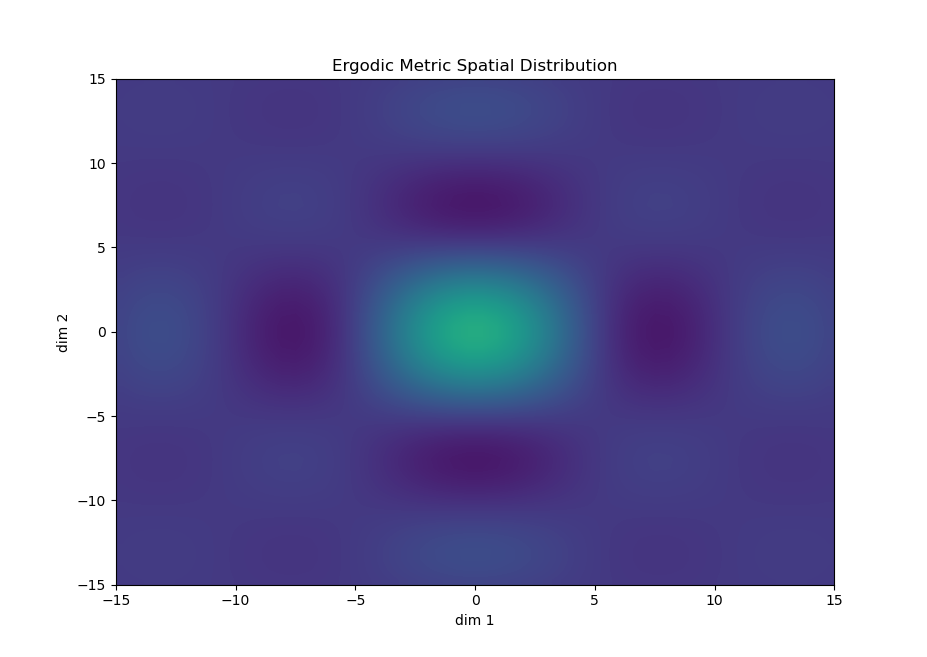

# Ergodic Library 
Author:       Ishaan Narain
Created:      15/02/2023 
Last Updated: 09/06/2023 

## Package Description
This package contains an Ergodic Library which contains a C++ implementation of a Controller, Ergodic Measurement Coefficient Calculator, and an Ergodic Controller. All classes and methods are under the `ergodiclib` namespace. 

Note that Doxygen documentation will be generated along side the build as part of CMake. 

## Python Scripts
### Cartpole Dynamics Plotter
`ros2 run ergodiclib visualize_ergodic.py ergodic_properties demonstration_folder`

This script generates plots of the fourier spatial mapping generated by the ergodic measurements of the demonstration trajectories.

The parameters of the `visualize_ergodic.py` are listed as follows:
* ergodic_properties (string) : File path to the ergodic properties json file
* demonstration_folder (string) : File path to the folder containing all demonstrations trajectories

## References
Kalinowska, A., Prabhakar, A., Fitzsimons, K., &amp; Murphey, T. (2021). Ergodic imitation: Learning from what to do and what not to do. 2021 IEEE International Conference on Robotics and Automation (ICRA). https://doi.org/10.1109/icra48506.2021.9561746

Mathew, George & Mezic, Igor. (2011). Metrics for ergodicity and design of ergodic dynamics for multi-agent systems. Physica D: Nonlinear Phenomena. 240. 10.1016/j.physd.2010.10.010.
